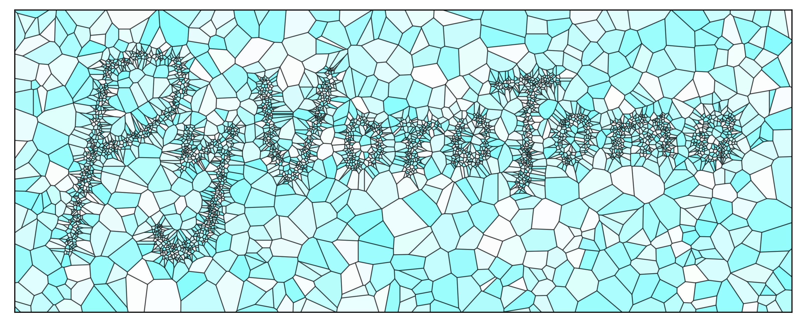

# Welcome to the *PyVoroTomo* repository!

This code implements the Poisson Voronoi cells based seismic traveltime tomography method (Fang et al., 2020). Currently, it fits best for local and regional scale applications. PyKonal (White et al., 2020)
is used for calculating traveltimes and tracing rays.

## Documentation
Working on it...

## Citation
If you make use of this code in published work, please cite Fang *et al.* (2020).

## Installation
Refer to [https://github.com/malcolmw/PyVoroTomo/wiki/Installation](https://github.com/malcolmw/PyVoroTomo/wiki/Installation) for both laptops and clusters.

## References
1. Fang, H., van der Hilst, R. D., de Hoop, M. V., Kothari, K., Gupta, S., & Dokmanić, I. (2020). Parsimonious seismic tomography with Poisson Voronoi projections: Methodology and validation. Seismological Research Letters, 91(1), 343-355.
2. White, M. C. A., Fang, H., Nakata, N., & Ben-Zion, Y. (2020). PyKonal: A Python Package for Solving the Eikonal Equation in Spherical and Cartesian Coordinates Using the Fast Marching Method. *Seismological Research Letters, 91*(4), 2378-2389. https://doi.org/10.1785/0220190318
